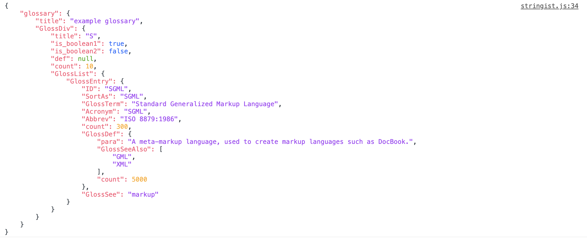

# Stringist

  `Stringist` logs `json` on the console beautifully.

  You don't need to do `console.log(JSON.stringify(json));` anymore.

  Just do `stringify(json);` to see a beautiful json in console.

  *It is written in JavaScript.*

## Download

  You can download with bower.

          $ bower install stringist

## Usage

  You can use stringist as `stringist(json);`.

          var json = {
            "glossary": {
              "title": "example glossary",
              "GlossDiv": {
                "title": "S",
                "is_boolean1": true,
                "is_boolean2": false,
                "abc": undefined,
                "def": null,
                "count": 10,
                "GlossList": {
                    "GlossEntry": {
                      "ID": "SGML",
                      "SortAs": "SGML",
                      "GlossTerm": "Standard Generalized Markup Language",
                      "Acronym": "SGML",
                      "Abbrev": "ISO 8879:1986",
                      "count": 300,
                      "GlossDef": {
                        "para": "A meta-markup language, used to create markup languages such as DocBook.",
                        "GlossSeeAlso": ["GML", "XML"],
                        "count": 5000
                      },
                    "GlossSee": "markup"
                  }
                }
              }
            }
          }

          stringist(json); // It is like "Console.log()"

  

## Reference

  This is rewritten with reference to the following `Milen Boev`'s answer.

  Milen Boev's answer (Dec 19 2016): [https://stackoverflow.com/a/21432248](https://stackoverflow.com/a/21432248)

## Todo

  
